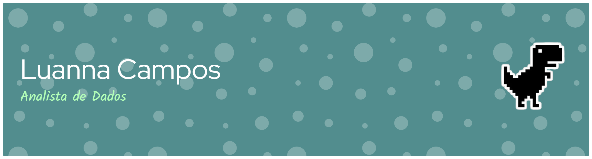

-----

  

-----  
-----

   

   

     
 Sobre mim:

    

  

<table>
<tr>

<td valign="top">

<ul>
<li>Olá, me chamo Luanna Campos e estou cursando o curso de Ciências de Dados e IA na renomada PUC MINAS.</li>

<li>Aqui no meu GitHub você vai encontrar projetos, experimentos e estudos que fazem parte da minha jornada na área de dados. Muitos deles surgem de curiosidade, de desafios da faculdade ou de ideias que tive vontade de testar na prática. Para mim, programar e trabalhar com dados também é uma forma de aprender constantemente e construir coisas novas.</li>

<li>Além da parte técnica, também gosto muito de contribuir com a comunidade acadêmica. Atualmente sou coordenadora do Programa de Apadrinhamento do curso, uma iniciativa voltada para acolher e orientar estudantes que estão começando a graduação.</li>

<li>Meus hobbies são leitura 📚, jogos 🎮, cozinhar 🍪 e assistir a podcasts de true crime 🧐.</li>

<li>Cinemáticamente falando, gosto de "Piratas do Caribe", "Percy Jackson" e "HunterxHunter".</li>

<li>Adoro ajudar as pessoas! 💙</li>

<li>📬 Se quiser conversar ou colaborar, você pode me encontrar pelo 
<a href="mailto:luanna.rodrigues.campos@gmail.com">e-mail pessoal</a> ou 
<a href="mailto:luanna.rodrigues.campos@gmail.com">e-mail profissional</a>.</li>
</ul>

</td>

<td width="40%" align="center" valign="middle">

</td>

</tr>
</table>

-----
 Linguagens e ferramentas:
 Linguagens e ferramentas:

&nbsp;
         

&nbsp;

&nbsp;

&nbsp;

&nbsp;

&nbsp;

&nbsp;

&nbsp;

&nbsp;

&nbsp;

&nbsp;

&nbsp;

-----

-----

## Contacts:

 

 

-----

🎧 Meu Spotify

<!---

--->

<table>
<tr>
 <td align="center" colspan="3"></td>
</tr> 
<tr>
<td>

</td>
<td>

</td>
<td>

</td>
</tr>
<tr>
 <td align="center" colspan="3"></td>
</tr> 
</table>

<picture>
  <source media="(prefers-color-scheme: dark)"
    srcset="https://raw.githubusercontent.com/luanna r/luanna r/output/pacman-contribution-graph-dark.svg">
  <source media="(prefers-color-scheme: light)"
    srcset="https://raw.githubusercontent.com/luanna r/luanna r/output/pacman-contribution-graph.svg">
  
</picture>

-----
<!--
<picture>
  <source media="(prefers-color-scheme: dark)"
    srcset="https://raw.githubusercontent.com/luanna r/luanna r/output/github-snake-dark.svg">
  <source media="(prefers-color-scheme: light)"
    srcset="https://raw.githubusercontent.com/luanna r/luanna r/output/github-snake.svg">
  
</picture>

----->

